# TemplumIS – Comprehensive Implementation Plan v2.0

**Document Version**: 2.0  
**Last Updated**: April 1, 2026  
**Status**: Phase 1 Complete, Phase 2 Ready to Begin

---

## Table of Contents

1. [Executive Summary](#1-executive-summary)
2. [System Architecture Overview](#2-system-architecture-overview)
3. [Roles, Users & Permissions Model](#3-roles-users--permissions-model)
4. [Platform Foundation (IAM — Already Implemented)](#4-platform-foundation-iam--already-implemented)
5. [Module 1 – Enrollment & Student Success](#5-module-1--enrollment--student-success)
6. [Module 2 – Scholarship & Financial Aid](#6-module-2--scholarship--financial-aid)
7. [Module 3 – Student Support & Interaction](#7-module-3--student-support--interaction)
8. [Module 4 – Grants & Research Management](#8-module-4--grants--research-management)
9. [Cross-Cutting Platform Services](#9-cross-cutting-platform-services)
10. [External Integrations](#10-external-integrations)
11. [Phased Roadmap & Milestones](#11-phased-roadmap--milestones)
12. [Technical Standards & Compliance](#12-technical-standards--compliance)
13. [Testing & QA Strategy](#13-testing--qa-strategy)
14. [Deployment & DevOps](#14-deployment--devops)
15. [Workflows & Data Flows](#15-workflows--data-flows)
16. [Document Version History](#16-document-version-history)

---

## 1. Executive Summary

### 1.1 Mission Statement

TemplumIS is an **Open Infrastructure** enrollment, grants, and scholarship dashboard designed for **Tier 2–3 universities and research hospitals**. It transforms siloed institutional data into a unified intelligence layer to drive rankings, student retention, and research ROI.

### 1.2 Current Implementation Status

#### ✅ Phase 1 Complete (Foundation)
- **Multi-tenant infrastructure**: Docker Compose with PostgreSQL 16, FastAPI, Next.js 14, Nginx
- **Database schema**: Complete star-schema with all tables (students, scholarships, grants, support_tickets, etc.)
- **Authentication & Authorization**: JWT-based RBAC with role-based routing
- **Global Admin Portal**: Full CRUD for institutions, institution admins, analytics, activity logs
- **Institution Admin Portal**: User management, domain configuration, profile, analytics, activity logs
- **Public Portal**: Landing page, login/signup for regular users with domain validation
- **Audit Logging**: Comprehensive audit trail for all administrative actions

#### 🚧 Phase 2 Ready (Core Modules)
- Enrollment Module (schema exists, no implementation)
- Scholarship Module (schema exists, no implementation)
- Student Support Module (schema exists, no implementation)
- Grants & Research Module (schema exists, no implementation)
- Inter-module workflow automation
- ETL/data ingestion pipelines
- External API integrations

### 1.3 Deployment Model

TemplumIS supports three deployment modes:

- **Multitenant SaaS** — Single instance serving multiple institutions, isolated by `institution_id`
- **On-Premise** — Dedicated instance within university infrastructure
- **Hybrid** — Mix of shared and dedicated nodes, centrally managed

All modes share the same codebase. Tenant isolation enforced at database (foreign keys) and API (middleware) layers

---

## 2. System Architecture Overview

### 2.1 Technology Stack

| Layer | Technology | Version | Purpose |
|-------|-----------|---------|----------|
| **Frontend** | Next.js (App Router) | 14.x | Server-side rendering, routing, SEO |
| | Material UI (MUI) | 5.x | Enterprise UI components, theming |
| | Recharts | 2.x | Data visualization, analytics charts |
| **Backend** | FastAPI | 0.109+ | REST API, async operations |
| | Python | 3.12 | Business logic, ETL, data processing |
| | SQLAlchemy | 2.x | ORM, database abstraction |
| | Pydantic | 2.x | Data validation, serialization |
| | Celery | 5.x | Background jobs, scheduled tasks |
| | Redis | 7.x | Task queue, caching, sessions |
| **Database** | PostgreSQL | 16.x | Primary data store, JSONB support |
| **Infrastructure** | Docker Compose | 2.x | Container orchestration |
| | Nginx | 1.25+ | Reverse proxy, SSL termination |

### 2.2 System Architecture Diagram

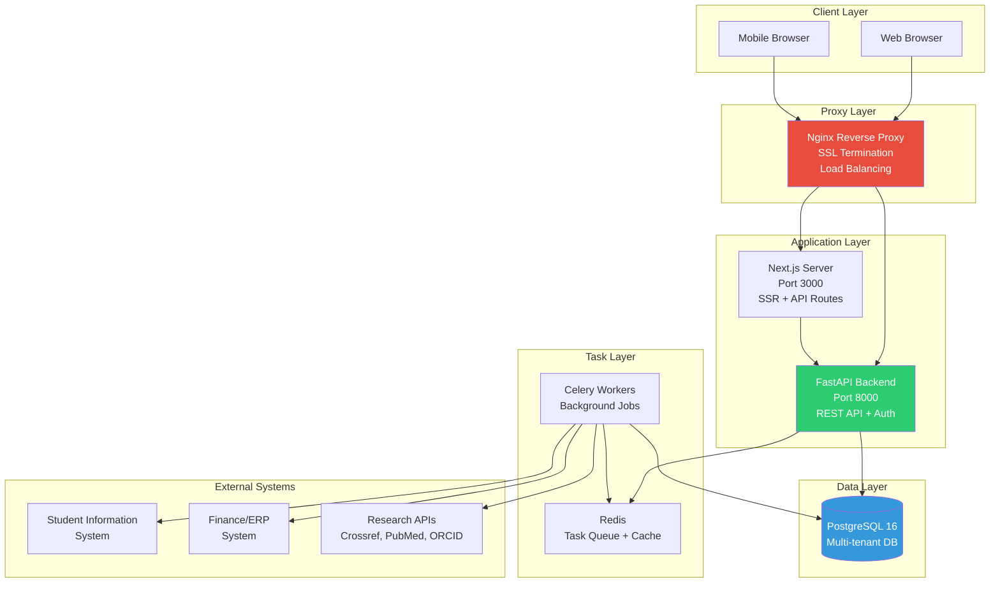

### 2.3 Multi-Tenant Data Isolation

**Strategy**: Shared schema with `institution_id` foreign keys on all tenant-scoped tables.

**Enforcement Layers**:

1. **Database Level**
   ```sql
   -- All tenant tables include:
   institution_id INT NOT NULL REFERENCES institutions(id) ON DELETE CASCADE
   
   -- Row-level security (optional enhancement):
   CREATE POLICY tenant_isolation ON students
   USING (institution_id = current_setting('app.current_institution_id')::int);
   ```

2. **API Middleware Level**
   ```python
   async def tenant_filter_middleware(request: Request, call_next):
       # Extract institution_id from JWT
       token = request.headers.get("Authorization")
       payload = decode_jwt(token)
       institution_id = payload.get("institution_id")
       
       # Inject into request state
       request.state.institution_id = institution_id
       
       # All queries automatically filtered
       response = await call_next(request)
       return response
   ```

3. **ORM Query Level**
   ```python
   # All queries automatically scoped:
   students = db.query(Student).filter(
       Student.institution_id == current_user.institution_id
   ).all()
   ```

### 2.4 API Design Patterns

**RESTful Conventions**:
```
GET    /api/resource              # List all (paginated)
POST   /api/resource              # Create new
GET    /api/resource/{id}         # Get one
PATCH  /api/resource/{id}         # Partial update
DELETE /api/resource/{id}         # Delete
GET    /api/resource/{id}/nested  # Nested resources
POST   /api/resource/{id}/action  # Custom actions
```

**Standard Response Format**:
```json
{
  "success": true,
  "data": {...},
  "meta": {
    "page": 1,
    "per_page": 20,
    "total": 150,
    "total_pages": 8
  }
}
```

**Error Response Format**:
```json
{
  "success": false,
  "error": {
    "code": "VALIDATION_ERROR",
    "message": "Invalid input data",
    "details": [
      {"field": "gpa", "message": "Must be between 0.0 and 4.0"}
    ]
  }
}
```

---

## 3. Roles, Users & Permissions Model

### 3.1 Account Hierarchy

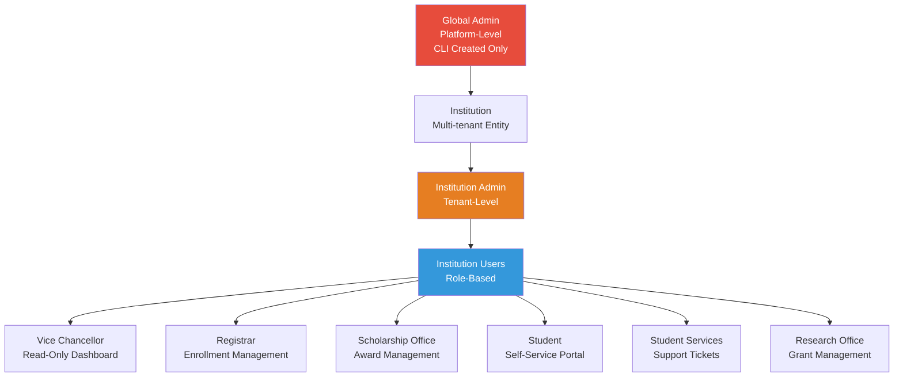

### 3.2 Complete Role Matrix

| Role | Scope | Creation Method | Primary Responsibilities |
|------|-------|----------------|-------------------------|
| **Global Admin** | All Institutions | CLI only (`python manage.py create-global-admin`) | Provision institutions, create institution admins, platform configuration, cross-tenant analytics |
| **Institution Admin** | Single Institution | Created by Global Admin | Domain configuration, user management, module settings, audit logs, institution profile |
| **Vice Chancellor** | Single Institution | Created by Institution Admin | Strategic dashboard, institutional rankings, read-only analytics across all modules |
| **Registrar** | Single Institution | Created by Institution Admin | Student enrollment, program/cohort management, TTD monitoring, graduation tracking |
| **Scholarship Office** | Single Institution | Created by Institution Admin | Scholarship creation, application review, award disbursement, compliance monitoring, donor reporting |
| **Student** | Single Institution | Self-registration (domain validated) | Personal dashboard, milestone tracking, scholarship applications, support ticket creation |
| **Student Services** | Single Institution | Created by Institution Admin | Support ticket management, student intervention, response time tracking |
| **Research Office** | Single Institution | Created by Institution Admin | Grant management, PI support, burn rate monitoring, IRB tracking, publication mapping |

### 3.3 Permission Matrix by Module

| Module | Global Admin | Inst Admin | Vice Chancellor | Registrar | Scholarship Office | Student | Student Services | Research Office |
|--------|-------------|------------|----------------|-----------|-------------------|---------|-----------------|----------------|
| **Platform Admin** | Full | None | None | None | None | None | None | None |
| **Institution Admin** | Read All | Full (Own) | None | None | None | None | None | None |
| **Enrollment** | Read All | Read (Own) | Read (Own) | Full (Own) | Read (Own) | Read (Self) | Read (Own) | Read (Own) |
| **Scholarships** | Read All | Read (Own) | Read (Own) | None | Full (Own) | Read/Apply (Self) | None | None |
| **Support Tickets** | Read All | Read (Own) | Read (Own) | None | Read (Own) | Create/Read (Self) | Full (Own) | Read (Own) |
| **Grants** | Read All | Read (Own) | Read (Own) | None | None | None | None | Full (Own) |
| **Analytics** | Full | Full (Own) | Read (Own) | Read (Own) | Read (Own) | Read (Self) | Read (Own) | Read (Own) |
| **Audit Logs** | Full | Read (Own) | None | None | None | None | None | None |

### 3.4 Authentication Flow

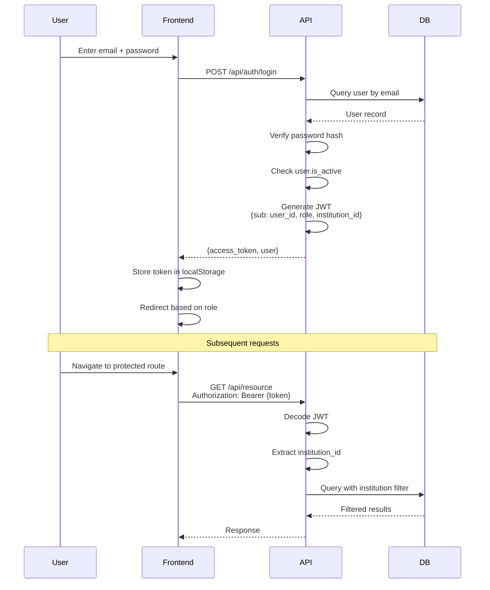

---

## 4. Platform Foundation (IAM — Already Implemented)

### 4.1 What Is Done ✅

#### Authentication & Authorization
- [x] JWT-based authentication with role-based access control
- [x] Password hashing with bcrypt
- [x] Token expiration and refresh logic
- [x] Role-based route protection (frontend & backend)
- [x] Domain validation for institution user signup

#### Global Admin Portal (`/global-admin`)
- [x] Institution CRUD (create, read, update, activate/deactivate, delete)
- [x] Institution Admin user creation and management
- [x] Platform-wide analytics dashboard
- [x] Activity log with pagination and filtering
- [x] Institution detail view with expandable activities

#### Institution Admin Portal (`/institution/admin`)
- [x] Domain management (add, edit, delete, set primary)
- [x] User management (create, edit, delete, role assignment)
- [x] Institution profile view and edit
- [x] Institution-scoped analytics dashboard
- [x] Institution-scoped activity log
- [x] Sidebar navigation layout

#### Public Portal
- [x] Landing page with navbar and footer
- [x] Login page for regular users (`/login`)
- [x] Signup page with domain validation (`/signup`)
- [x] Separate login pages for admins (`/global-admin/login`, `/institution/login`)

#### Database Schema
- [x] Multi-tenant schema with `institution_id` foreign keys
- [x] Complete star-schema: students, scholarships, grants, support_tickets
- [x] Audit log table with JSONB details
- [x] All necessary indexes for performance

#### Infrastructure
- [x] Docker Compose setup (PostgreSQL, FastAPI, Next.js, Nginx)
- [x] Nginx reverse proxy configuration
- [x] Environment variable management
- [x] Database initialization scripts

### 4.2 IAM Enhancements Required (Pre-Module Work)

#### Before Phase 2 Implementation

- [ ] **Add Celery + Redis for background jobs**
  - Required for: TTD calculation, compliance monitoring, scholarship compliance checks, IRB alerts
  - Setup: Add Redis container, Celery worker container, configure task queue
  
- [ ] **Implement notification system**
  - Database: Create `notifications` table
  - API: Endpoints for creating, reading, marking as read
  - Frontend: Notification bell component with dropdown
  - Backend: Notification service for cross-module events

- [ ] **Add email notification support (optional for Phase 2)**
  - SMTP configuration
  - Email templates for key events
  - Async email sending via Celery

- [ ] **Enhance audit logging**
  - Add `before_value` and `after_value` fields for change tracking
  - Implement audit log retention policy
  - Add audit log export functionality

---

## 5. Module 1 – Enrollment & Student Success

### 5.1 Overview

**Objective**: Monitor and optimize the student journey from admission to graduation.

**Key Metrics**:
- Time-to-Degree (TTD) by program and cohort
- Graduation rates and trends
- Student compliance status (green/yellow/red)
- At-risk student identification
- Bottleneck course analysis

### 5.2 Sub-Modules & Features

#### 5.2.1 Student Management
- Student CRUD operations
- Bulk import from SIS/CSV
- Program and cohort assignment
- Status tracking (active, on_leave, graduated, withdrawn, suspended)
- GPA and credit tracking

#### 5.2.2 Program & Cohort Management
- Program definition (name, department, degree level, expected duration)
- Cohort creation (start year, semester, program linkage)
- Expected graduation date calculation
- Program-level analytics

#### 5.2.3 TTD Calculation & Compliance
- Daily automated TTD calculation
- Compliance status determination (green/yellow/red)
- Trigger support workflows for at-risk students
- Historical compliance tracking

#### 5.2.4 Analytics & Reporting
- TTD heatmaps by program/cohort
- Graduation rate trends
- At-risk student lists with filters
- Enrollment trends over time
- Bottleneck course identification

### 5.3 Enrollment Module — Intra-Module Workflow

#### 5.3.1 Student Data Ingestion

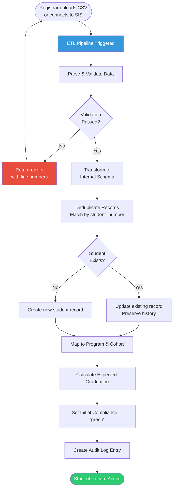

**Data Flowing Through Ingestion**:

| Step | Data Created/Updated | Table |
|------|---------------------|-------|
| Parse CSV | Raw data validated | Temporary staging |
| Create student | `Student` record (status=active) | `students` |
| Map program | `program_id` assigned | `students.program_id` |
| Map cohort | `cohort_id` assigned | `students.cohort_id` |
| Calculate graduation | `expected_graduation` date set | `students.expected_graduation` |
| Audit | Action logged | `audit_log` |

#### 5.3.2 TTD Calculation & Compliance Monitoring (Daily Job)

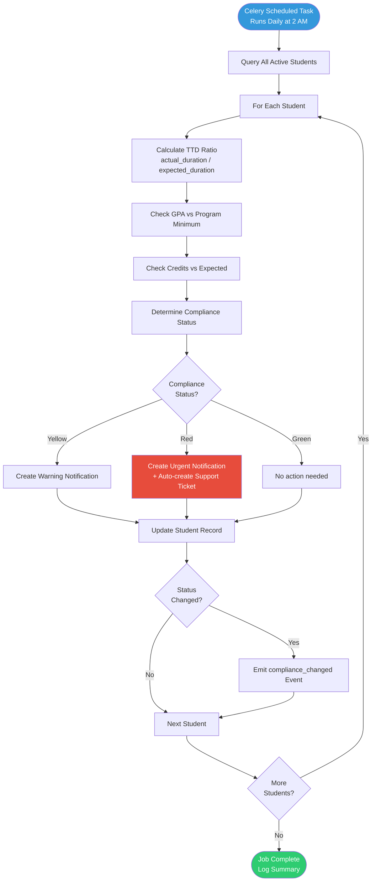

**Compliance Calculation Logic**:

```python
def calculate_compliance(student: Student) -> str:
    issues = []
    
    # TTD Check
    enrollment_duration = (datetime.now() - student.enrollment_date).days
    expected_duration = student.program.expected_duration_semesters * 120  # days
    ttd_ratio = enrollment_duration / expected_duration
    
    if ttd_ratio > 1.2:
        issues.append("severely_behind_schedule")
    elif ttd_ratio > 1.0:
        issues.append("behind_schedule")
    
    # GPA Check
    if student.program.min_gpa and student.gpa < student.program.min_gpa:
        issues.append("low_gpa")
    
    # Credits Check
    expected_credits = (enrollment_duration / expected_duration) * student.credits_required
    if student.credits_completed < expected_credits * 0.8:
        issues.append("insufficient_credits")
    
    # Determine compliance color
    if len(issues) >= 2 or "severely_behind_schedule" in issues:
        return "red"
    elif len(issues) == 1:
        return "yellow"
    else:
        return "green"
```

**Gate Conditions**:

| Gate | Condition Required |
|------|-------------------|
| TTD calculation | Student status = 'active', enrollment_date not null |
| Compliance change | New compliance != old compliance |
| Support ticket creation | Compliance = 'red' AND no open ticket exists |
| Notification creation | Compliance in ['yellow', 'red'] |

### 5.4 Enrollment Module — Backend Implementation Plan

#### API Endpoints

```
# Student Management
POST   /api/enrollment/students
GET    /api/enrollment/students?program_id=1&status=active&compliance=red
GET    /api/enrollment/students/{id}
PATCH  /api/enrollment/students/{id}
DELETE /api/enrollment/students/{id}
POST   /api/enrollment/students/bulk-import

# Program Management
POST   /api/enrollment/programs
GET    /api/enrollment/programs
GET    /api/enrollment/programs/{id}
PATCH  /api/enrollment/programs/{id}
DELETE /api/enrollment/programs/{id}

# Cohort Management
POST   /api/enrollment/cohorts
GET    /api/enrollment/cohorts
GET    /api/enrollment/cohorts/{id}
GET    /api/enrollment/cohorts/{id}/students
PATCH  /api/enrollment/cohorts/{id}
DELETE /api/enrollment/cohorts/{id}

# Analytics
GET    /api/enrollment/analytics/ttd?program_id=1&cohort_id=2
GET    /api/enrollment/analytics/graduation-rates
GET    /api/enrollment/analytics/at-risk?compliance=red&limit=50
GET    /api/enrollment/analytics/enrollment-trends
```

#### Database Models (Already Exist)

```python
# students table
class Student(Base):
    id, institution_id, user_id, student_number
    program_id, cohort_id, status
    enrollment_date, expected_graduation, actual_graduation
    gpa, credits_completed, credits_required
    compliance  # 'green', 'yellow', 'red'

# programs table
class Program(Base):
    id, institution_id, name, department
    degree_level, expected_duration_semesters
    min_gpa  # Add this field

# cohorts table
class Cohort(Base):
    id, institution_id, name, program_id
    start_year, start_semester
```

#### Celery Tasks

```python
@celery.task
def calculate_ttd_and_compliance():
    """Daily job to calculate TTD and update compliance status"""
    institutions = db.query(Institution).filter(Institution.is_active == True).all()
    
    for institution in institutions:
        students = db.query(Student).filter(
            Student.institution_id == institution.id,
            Student.status == 'active'
        ).all()
        
        for student in students:
            old_compliance = student.compliance
            new_compliance = calculate_compliance(student)
            
            if old_compliance != new_compliance:
                student.compliance = new_compliance
                db.commit()
                
                # Emit event
                emit_event('compliance_changed', {
                    'student_id': student.id,
                    'old_compliance': old_compliance,
                    'new_compliance': new_compliance
                })
```

### 5.5 Enrollment Module — Frontend Implementation Plan

#### Pages

- `/enrollment/students` - Student list with filters, search, pagination
- `/enrollment/students/{id}` - Student detail view with edit capability
- `/enrollment/students/import` - CSV import wizard
- `/enrollment/programs` - Program management
- `/enrollment/cohorts` - Cohort management
- `/enrollment/analytics` - TTD analytics dashboard

#### Key Components

```typescript
// StudentDataGrid.tsx
- MUI DataGrid with server-side pagination
- Filters: program, cohort, status, compliance
- Search by name or student number
- Bulk actions: export, update status
- Compliance badge with color coding

// TTDHeatmap.tsx
- Recharts heatmap showing TTD by program/cohort
- Color gradient: green (on track) to red (behind)
- Click to drill down to student list

// ComplianceIndicator.tsx
- Chip component with color: green/yellow/red
- Tooltip showing specific issues
- Link to student detail

// StudentImportWizard.tsx
- Multi-step form: Upload → Map Columns → Validate → Import
- Progress indicator
- Error handling with line-by-line feedback
```

---

## 6. Module 2 – Scholarship & Financial Aid

### 6.1 Overview

**Objective**: Ensure financial sustainability for students and audit-ready records for donors.

**Key Metrics**:
- Total scholarships available vs. disbursed
- Application approval rates
- Student compliance with scholarship requirements
- Donor impact metrics (graduation rates, GPA of recipients)
- Financial aid utilization rates

### 6.2 Sub-Modules & Features

#### 6.2.1 Scholarship Management
- Scholarship CRUD operations
- Funding source linkage
- Eligibility criteria definition (GPA, credits, status)
- Award amount and academic year tracking
- Status management (open, under_review, awarded, renewed, closed)

#### 6.2.2 Application Workflow
- Student application submission
- Document upload and management
- Eligibility validation (automated)
- Application review interface for office staff
- Approval/rejection workflow
- Award notification

#### 6.2.3 Compliance Monitoring
- Semester-end compliance checks
- GPA and credit requirement validation
- Automatic status updates (renewed/under_review/revoked)
- Student notifications for compliance issues

#### 6.2.4 Donor Reporting
- Impact reports by funding source
- Recipient success metrics
- Graduation rates of scholarship recipients
- Financial utilization reports

### 6.3 Scholarship Module — Intra-Module Workflow

#### 6.3.1 Scholarship Creation & Student Application

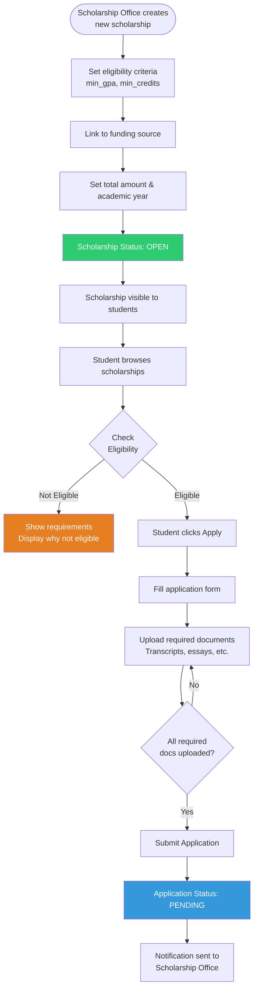

**Eligibility Validation Logic**:

```python
def check_eligibility(student: Student, scholarship: Scholarship) -> tuple[bool, list[str]]:
    errors = []
    
    # GPA requirement
    if scholarship.min_gpa and student.gpa < scholarship.min_gpa:
        errors.append(f"GPA {student.gpa} below minimum {scholarship.min_gpa}")
    
    # Credits requirement
    if scholarship.min_credits and student.credits_completed < scholarship.min_credits:
        errors.append(f"Credits {student.credits_completed} below minimum {scholarship.min_credits}")
    
    # Student status
    if student.status != 'active':
        errors.append(f"Student must be active, currently {student.status}")
    
    # Compliance status
    if student.compliance == 'red':
        errors.append("Student has red compliance status")
    
    # Already applied
    existing = db.query(ScholarshipApplication).filter(
        ScholarshipApplication.student_id == student.id,
        ScholarshipApplication.scholarship_id == scholarship.id
    ).first()
    if existing:
        errors.append("Already applied to this scholarship")
    
    return len(errors) == 0, errors
```

#### 6.3.2 Application Review & Award Decision

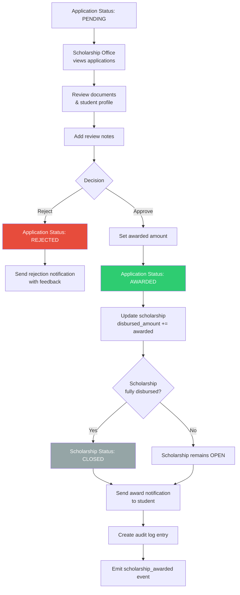

**Data Flowing Through Award Process**:

| Step | Data Created/Updated | Table |
|------|---------------------|-------|
| Application submitted | `ScholarshipApplication` (status=pending) | `scholarship_applications` |
| Review notes added | `review_notes` updated | `scholarship_applications` |
| Award approved | `status=awarded`, `awarded_amount` set | `scholarship_applications` |
| Disbursement updated | `disbursed_amount` incremented | `scholarships` |
| Scholarship closed | `status=closed` | `scholarships` |
| Notification created | Notification record | `notifications` |
| Audit logged | Action logged | `audit_log` |

#### 6.3.3 Semester-End Compliance Check (Scheduled Job)

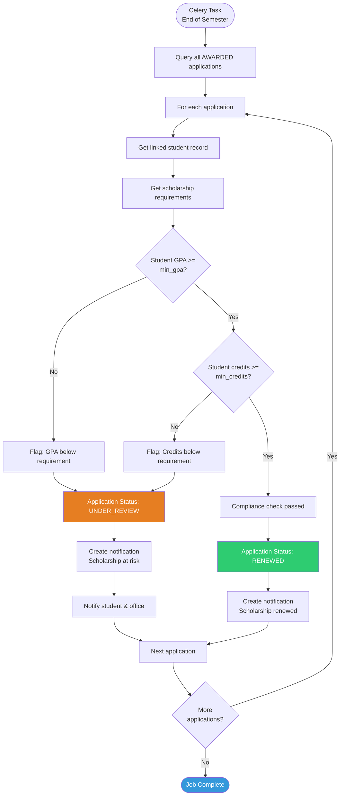

**Gate Conditions**:

| Gate | Condition Required |
|------|-------------------|
| Eligibility check | Student status = 'active', compliance != 'red' |
| Application submission | All required documents uploaded |
| Award approval | Scholarship not fully disbursed |
| Compliance check | Semester grades posted, student record updated |
| Renewal | GPA >= min_gpa AND credits >= min_credits |

### 6.4 Scholarship Module — Backend Implementation Plan

#### API Endpoints

```
# Scholarship Management
POST   /api/scholarships
GET    /api/scholarships
GET    /api/scholarships/{id}
PATCH  /api/scholarships/{id}
DELETE /api/scholarships/{id}
POST   /api/scholarships/{id}/close

# Student View
GET    /api/scholarships/available?student_id={id}
GET    /api/scholarships/{id}/eligibility?student_id={id}

# Application Management
POST   /api/scholarships/{id}/applications
GET    /api/scholarships/{id}/applications
GET    /api/scholarships/applications/{app_id}
PATCH  /api/scholarships/applications/{app_id}
POST   /api/scholarships/applications/{app_id}/documents

# Student Applications
GET    /api/students/me/scholarships
GET    /api/students/me/applications

# Funding Sources
POST   /api/funding-sources
GET    /api/funding-sources
PATCH  /api/funding-sources/{id}

# Analytics
GET    /api/scholarships/analytics/disbursement
GET    /api/scholarships/analytics/impact?funding_source_id={id}
GET    /api/scholarships/reports/donor/{source_id}
```

#### Database Models (Already Exist)

```python
# scholarships table
class Scholarship(Base):
    id, institution_id, name, funding_source_id
    total_amount, disbursed_amount
    eligibility_criteria, min_gpa, min_credits
    status  # 'open', 'under_review', 'awarded', 'renewed', 'revoked', 'closed'
    academic_year

# scholarship_applications table
class ScholarshipApplication(Base):
    id, student_id, scholarship_id
    application_date, status
    documents_submitted, review_notes
    awarded_amount

# funding_sources table
class FundingSource(Base):
    id, institution_id, name
    type  # 'internal', 'external_ngo', 'government', 'donor'
    contact_info
```

#### Celery Tasks

```python
@celery.task
def check_scholarship_compliance():
    """Semester-end job to check scholarship compliance"""
    awarded_apps = db.query(ScholarshipApplication).filter(
        ScholarshipApplication.status == 'awarded'
    ).all()
    
    for app in awarded_apps:
        student = db.query(Student).get(app.student_id)
        scholarship = db.query(Scholarship).get(app.scholarship_id)
        
        is_compliant = True
        reasons = []
        
        if scholarship.min_gpa and student.gpa < scholarship.min_gpa:
            is_compliant = False
            reasons.append(f"GPA {student.gpa} below {scholarship.min_gpa}")
        
        if scholarship.min_credits and student.credits_completed < scholarship.min_credits:
            is_compliant = False
            reasons.append(f"Credits {student.credits_completed} below {scholarship.min_credits}")
        
        if not is_compliant:
            app.status = 'under_review'
            db.commit()
            
            # Notify student
            create_notification(
                user_id=student.user_id,
                type='scholarship_compliance_warning',
                message=f"Your {scholarship.name} is under review: {', '.join(reasons)}"
            )
        else:
            app.status = 'renewed'
            db.commit()
```

### 6.5 Scholarship Module — Frontend Implementation Plan

#### Pages

- `/scholarships` - Browse scholarships (student view)
- `/scholarships/{id}` - Scholarship details & apply
- `/scholarships/my-applications` - Student's applications
- `/scholarships/manage` - Manage scholarships (office view)
- `/scholarships/applications` - Review applications (office view)
- `/scholarships/analytics` - Disbursement analytics

#### Key Components

```typescript
// ScholarshipCard.tsx
- Card showing scholarship name, amount, deadline
- Eligibility badge (eligible/not eligible)
- Apply button (disabled if not eligible)
- Tooltip showing requirements

// ApplicationForm.tsx
- Multi-step form: Info → Documents → Review → Submit
- Document upload with drag-and-drop
- Progress indicator
- Validation at each step

// ApplicationReviewPanel.tsx
- Split view: application details + student profile
- Document viewer
- Review notes textarea
- Approve/Reject buttons with confirmation

// DisbursementChart.tsx
- Pie chart: total vs. disbursed by funding source
- Bar chart: disbursement trends over time
- Drill-down to recipient list

// ImpactDashboard.tsx
- Donor-specific metrics
- Recipient success rates
- Graduation rates comparison
- Export to PDF for donor reports
```

---

## 7. Module 3 – Student Support & Interaction

### 7.1 Overview

**Objective**: Empower students with self-service tools and proactive support.

**Key Metrics**:
- Average support ticket response time
- Average resolution time
- Ticket volume by category
- Student satisfaction scores
- Proactive intervention success rate

### 7.2 Sub-Modules & Features

#### 7.2.1 Student Dashboard
- Personalized view of academic progress
- Milestone tracker with progress bar
- Compliance status indicator
- Scholarship status summary
- Open support tickets

#### 7.2.2 Automated Nudges & Notifications
- Compliance warnings (yellow/red status)
- Scholarship deadline reminders
- GPA drop alerts
- Missing document notifications
- In-app and email notifications

#### 7.2.3 Support Ticket System
- Ticket creation with category selection
- Auto-assignment based on category
- Priority calculation
- Status tracking (open, in_progress, resolved, closed)
- Message thread for communication

#### 7.2.4 Staff Management Interface
- Assigned ticket queue
- Ticket detail view with student context
- Response time tracking
- SLA monitoring
- Workload distribution analytics

### 7.3 Student Support Module — Intra-Module Workflow

#### 7.3.1 Support Ticket Creation & Auto-Assignment

```mermaid
flowchart TD
    A([Student clicks<br/>"Request Support"]) --> B[Select ticket category<br/>academic, financial, technical, other]
    B --> C[Enter subject & description]
    C --> D[Submit ticket]
    D --> E[Ticket Status: OPEN]
    E --> F[Calculate priority<br/>based on student compliance]
    
    F --> G{Category?}
    G -- academic --> H[Assign to Academic Adviser]
    G -- financial --> I[Assign to Scholarship Office]
    G -- technical --> J[Assign to IT Support]
    G -- other --> K[Assign to Student Services]
    
    H --> L[Create notification<br/>for assigned staff]
    I --> L
    J --> L
    K --> L
    L --> M[Emit ticket_created event]
    M --> N([Ticket in Staff Queue])
    
    style E fill:#3498db,color:#fff
    style N fill:#2ecc71,color:#fff
```

**Priority Calculation Logic**:

```python
def calculate_ticket_priority(student: Student, category: str) -> str:
    priority = "normal"
    
    # Escalate if student has red compliance
    if student.compliance == "red":
        priority = "high"
    
    # Escalate financial issues
    if category == "financial":
        priority = "high"
    
    # Escalate if student has multiple open tickets
    open_tickets = db.query(SupportTicket).filter(
        SupportTicket.student_id == student.id,
        SupportTicket.status.in_(['open', 'in_progress'])
    ).count()
    
    if open_tickets >= 3:
        priority = "urgent"
    
    return priority
```

#### 7.3.2 Ticket Resolution Workflow

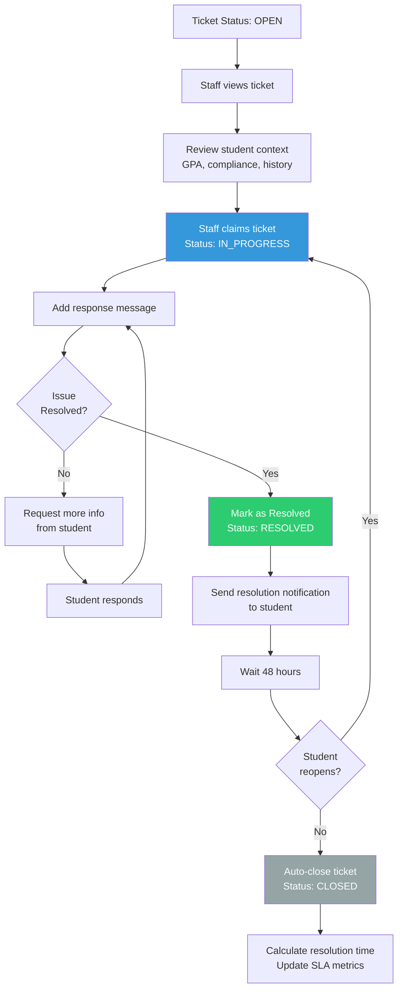

**Gate Conditions**:

| Gate | Condition Required |
|------|-------------------|
| Ticket creation | Student must be active |
| Staff assignment | Staff role matches category |
| Mark resolved | Response provided to student |
| Auto-close | 48 hours passed since resolved, no student response |

### 7.4 Student Support Module — Backend Implementation Plan

#### API Endpoints

```
# Student Dashboard
GET    /api/students/me/dashboard
GET    /api/students/me/milestones
GET    /api/students/me/notifications?unread=true
PATCH  /api/students/me/notifications/{id}/read

# Support Tickets (Student)
POST   /api/support/tickets
GET    /api/support/tickets/my-tickets
GET    /api/support/tickets/{id}
POST   /api/support/tickets/{id}/messages

# Support Tickets (Staff)
GET    /api/support/tickets?status=open&assigned_to=me
PATCH  /api/support/tickets/{id}
POST   /api/support/tickets/{id}/claim
POST   /api/support/tickets/{id}/resolve

# Analytics
GET    /api/support/analytics/sla
GET    /api/support/analytics/workload
```

#### Database Models (Already Exist)

```python
# support_tickets table
class SupportTicket(Base):
    id, institution_id, student_id, assigned_to
    subject, description
    status  # 'open', 'in_progress', 'resolved', 'closed'
    priority  # 'normal', 'high', 'urgent'
    created_at, resolved_at, updated_at

# notifications table (to be created)
class Notification(Base):
    id, user_id, type, message
    data  # JSONB for additional context
    read, created_at
```

### 7.5 Student Support Module — Frontend Implementation Plan

#### Pages

- `/dashboard` - Student personalized dashboard
- `/support/tickets` - My support tickets (student)
- `/support/new` - Create new ticket
- `/support/staff` - Staff ticket management
- `/support/tickets/{id}` - Ticket detail with messages

#### Key Components

```typescript
// StudentDashboard.tsx
- Progress card with milestone tracker
- Compliance badge (prominent if yellow/red)
- Quick actions: Apply for scholarship, Request support
- Recent notifications
- Upcoming deadlines

// MilestoneTracker.tsx
- Linear progress bar
- Milestone markers with checkmarks
- Expected vs. actual timeline
- Tooltip with details

// TicketList.tsx
- DataGrid with filters (status, category, priority)
- Color-coded priority badges
- Quick actions: view, respond
- SLA indicator (overdue tickets highlighted)

// TicketDetail.tsx
- Message thread view
- Student context sidebar (GPA, compliance, scholarships)
- Response textarea with rich text
- Status update buttons
- Related tickets section
```

---

## 8. Module 4 – Grants & Research Management

### 8.1 Overview

**Objective**: Track research investment vs. academic and commercial output.

**Key Metrics**:
- Total active grants and funding secured
- Burn rate by grant and department
- Publication output linked to grants
- IRB compliance and renewal alerts
- Grant success rate (approved/submitted)

### 8.2 Sub-Modules & Features

#### 8.2.1 Grant Management
- Grant CRUD operations
- PI assignment and department linkage
- Budget tracking (total, spent, remaining)
- Status management (submitted, under_review, active, completed, rejected)
- Start/end date tracking

#### 8.2.2 Financial Tracking
- Expenditure recording by category
- Burn rate calculation and monitoring
- Budget alerts for overspending
- Variance reporting

#### 8.2.3 IRB/Ethics Compliance
- IRB clearance date tracking
- Expiry date monitoring
- 60-day renewal alerts
- Compliance status indicators

#### 8.2.4 Publication Mapping
- Manual publication entry
- DOI and ORCID linkage
- Auto-scraping from Crossref/PubMed (future)
- Grant-to-publication mapping
- Impact metrics

### 8.3 Grants Module — Intra-Module Workflow

#### 8.3.1 Grant Lifecycle

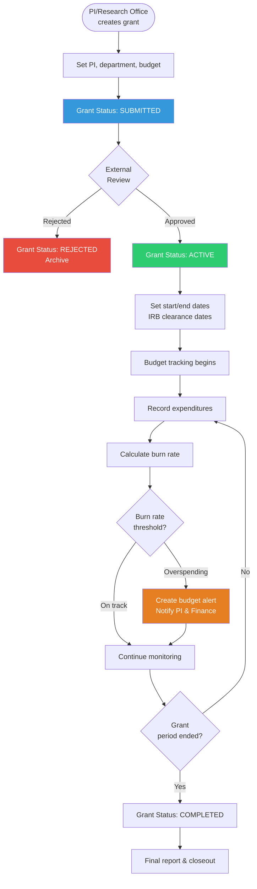

#### 8.3.2 IRB Compliance Monitoring (Daily Job)

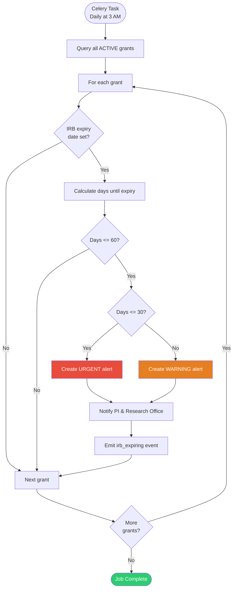

**Burn Rate Calculation**:

```python
def calculate_burn_rate_status(grant: Grant) -> dict:
    if not grant.start_date or not grant.end_date:
        return {"status": "unknown", "message": "Dates not set"}
    
    # Calculate burn rate
    burn_rate = grant.spent_amount / grant.total_budget if grant.total_budget > 0 else 0
    
    # Calculate time elapsed
    total_duration = (grant.end_date - grant.start_date).days
    elapsed_duration = (datetime.now() - grant.start_date).days
    time_elapsed = elapsed_duration / total_duration if total_duration > 0 else 0
    
    # Determine status
    if burn_rate > time_elapsed * 1.2:
        return {
            "status": "overspending",
            "burn_rate": burn_rate,
            "time_elapsed": time_elapsed,
            "message": f"Spending {(burn_rate/time_elapsed - 1)*100:.1f}% faster than schedule"
        }
    elif burn_rate < time_elapsed * 0.5:
        return {
            "status": "underspending",
            "burn_rate": burn_rate,
            "time_elapsed": time_elapsed,
            "message": f"Spending {(1 - burn_rate/time_elapsed)*100:.1f}% slower than schedule"
        }
    else:
        return {
            "status": "on_track",
            "burn_rate": burn_rate,
            "time_elapsed": time_elapsed,
            "message": "Spending on track with timeline"
        }
```

### 8.4 Grants Module — Backend Implementation Plan

#### API Endpoints

```
# Grant Management
POST   /api/grants
GET    /api/grants?status=active&pi_id={id}
GET    /api/grants/{id}
PATCH  /api/grants/{id}
DELETE /api/grants/{id}

# Expenditure Tracking
POST   /api/grants/{id}/expenditures
GET    /api/grants/{id}/expenditures

# Publication Management
POST   /api/grants/{id}/publications
GET    /api/grants/{id}/publications
DELETE /api/grants/publications/{pub_id}

# Analytics
GET    /api/grants/analytics/overview
GET    /api/grants/analytics/burn-rate?department={dept}
GET    /api/grants/analytics/department-performance
GET    /api/grants/irb-alerts
```

#### Database Models (Already Exist)

```python
# grants table
class Grant(Base):
    id, institution_id, title, principal_investigator_id
    funding_source_id, department
    total_budget, spent_amount
    status  # 'submitted', 'under_review', 'active', 'completed', 'rejected'
    start_date, end_date
    irb_clearance_date, irb_expiry_date

# grant_publications table
class GrantPublication(Base):
    id, grant_id, title, doi, orcid_id
    publication_date, journal
```

### 8.5 Grants Module — Frontend Implementation Plan

#### Pages

- `/grants` - Grant list and management
- `/grants/{id}` - Grant detail with expenditures and publications
- `/grants/analytics` - Research analytics dashboard
- `/grants/irb-alerts` - IRB compliance alerts

#### Key Components

```typescript
// GrantCard.tsx
- Grant title, PI, department
- Budget gauge (spent vs. total)
- Burn rate indicator with color
- Status badge
- IRB expiry warning (if applicable)

// BurnRateGauge.tsx
- Circular gauge showing burn rate
- Color: green (on track), yellow (underspending), red (overspending)
- Tooltip with detailed breakdown

// ExpenditureChart.tsx
- Stacked bar chart by category (personnel, equipment, travel, other)
- Timeline view of spending
- Budget line overlay

// IRBAlertBanner.tsx
- Prominent warning banner for expiring IRB
- Days remaining countdown
- Action button: "Renew IRB"
```

---

## 15. Workflows & Data Flows

This section documents all significant workflows at two levels:

- **Inter-module workflows** — how events, data, and state changes cross module boundaries
- **Intra-module workflows** — the step-by-step process flows within each individual module

Each workflow shows: actors, states, gate conditions, event triggers, and the data payloads that move between steps.

### 15.1 Inter-Module Workflow: Full TemplumIS Lifecycle

```mermaid
flowchart TD
    %% ENROLLMENT MODULE
    A([Student Enrolled<br/>SIS Data Import]) --> B[Student Record Created<br/>Status: ACTIVE]
    B --> C[Program & Cohort Assigned]
    C --> D[Daily TTD Calculation Job]
    D --> E{Compliance<br/>Status?}
    E -- Green --> F[No action]
    E -- Yellow/Red --> G[compliance_changed EVENT]
    
    %% ENROLLMENT → SUPPORT
    G -->|Event: compliance_changed<br/>Payload: student_id, old_compliance,<br/>new_compliance, issues[]| H
    
    %% STUDENT SUPPORT MODULE
    H[Create Notification<br/>"Academic progress needs attention"] --> I[Auto-create Support Ticket<br/>Category: academic, Priority: high]
    I --> J[Assign to Academic Adviser]
    J --> K[Staff Resolves Ticket]
    
    %% ENROLLMENT → SCHOLARSHIP
    B --> L[Student GPA Updated<br/>Semester grades posted]
    L --> M{Check Scholarship<br/>Eligibility}
    M -- Newly Eligible --> N[student_eligible EVENT]
    N -->|Event: student_eligible<br/>Payload: student_id,<br/>scholarship_ids[]| O
    
    %% SCHOLARSHIP MODULE
    O[Create Notification<br/>"You qualify for X scholarships"] --> P[Student Applies]
    P --> Q[Scholarship Office Reviews]
    Q --> R{Decision}
    R -- Approved --> S[scholarship_awarded EVENT]
    R -- Rejected --> T[Application Archived]
    
    S -->|Event: scholarship_awarded<br/>Payload: student_id, scholarship_id,<br/>amount, academic_year| U[Update Student Financial Record]
    
    %% SCHOLARSHIP COMPLIANCE
    L --> V[Semester-End Compliance Check]
    V --> W{Scholarship<br/>Requirements Met?}
    W -- No --> X[scholarship_compliance_warning EVENT]
    W -- Yes --> Y[Application Status: RENEWED]
    
    X -->|Event: scholarship_compliance_warning<br/>Payload: student_id, scholarship_id,<br/>violations[]| Z[Notify Student & Office]
    
    %% GRANTS MODULE
    AA([Grant Approved]) --> AB[Grant Status: ACTIVE]
    AB --> AC[PI Records Expenditures]
    AC --> AD[Burn Rate Calculation]
    AD --> AE{Burn Rate<br/>Threshold?}
    AE -- Overspending --> AF[budget_alert EVENT]
    AF -->|Event: budget_alert<br/>Payload: grant_id, burn_rate,<br/>projected_overspend| AG[Notify PI & Finance]
    
    AB --> AH[IRB Expiry Monitoring]
    AH --> AI{Days to<br/>Expiry <= 60?}
    AI -- Yes --> AJ[irb_expiring EVENT]
    AJ -->|Event: irb_expiring<br/>Payload: grant_id, days_remaining,<br/>urgency_level| AK[Notify PI & Research Office]
    
    %% GRANTS → ENROLLMENT (Research Assistantships)
    AB --> AL[PI Allocates RA Budget]
    AL --> AM[ra_position_available EVENT]
    AM -->|Event: ra_position_available<br/>Payload: grant_id, requirements,<br/>stipend_amount| AN[Match Eligible Students<br/>GPA >= 3.5, Compliance: green]
    AN --> AO[Notify Eligible Students]
    
    style G fill:#e74c3c,color:#fff
    style S fill:#2ecc71,color:#fff
    style X fill:#e67e22,color:#fff
    style AF fill:#e67e22,color:#fff
    style AJ fill:#e67e22,color:#fff
```

### 15.2 Inter-Module Event Catalogue

Every cross-module interaction is triggered by a named event. This table is the contract between modules.

| Event Name | Emitted By | Consumed By | Trigger Condition | Payload |
|---|---|---|---|---|
| `compliance_changed` | Enrollment Module | Student Support Module | Student compliance status changes to yellow/red | `student_id`, `old_compliance`, `new_compliance`, `issues[]`, `ttd_ratio` |
| `student_eligible` | Enrollment Module | Scholarship Module | Student GPA/credits updated and newly eligible for scholarships | `student_id`, `scholarship_ids[]`, `gpa`, `credits_completed` |
| `scholarship_awarded` | Scholarship Module | Enrollment Module, Finance Connector | Scholarship application approved | `student_id`, `scholarship_id`, `amount`, `academic_year`, `funding_source_id` |
| `scholarship_compliance_warning` | Scholarship Module | Student Support Module | Semester-end check: student fails scholarship requirements | `student_id`, `scholarship_id`, `violations[]`, `current_gpa`, `current_credits` |
| `scholarship_renewed` | Scholarship Module | Student Support Module | Semester-end check: student meets requirements | `student_id`, `scholarship_id`, `academic_year` |
| `budget_alert` | Grants Module | Finance Officer (notification), Research Office | Burn rate exceeds threshold (>120% of timeline) | `grant_id`, `burn_rate`, `time_elapsed`, `projected_overspend`, `pi_id` |
| `irb_expiring` | Grants Module | Research Office, PI | IRB expiry date within 60 days | `grant_id`, `irb_expiry_date`, `days_remaining`, `urgency_level` ('warning' or 'urgent') |
| `ra_position_available` | Grants Module | Enrollment Module | Grant activated with RA budget allocation | `grant_id`, `position_count`, `requirements{}`, `stipend_amount`, `department` |
| `ticket_created` | Student Support Module | Assigned Staff | Student creates support ticket | `ticket_id`, `student_id`, `category`, `priority`, `subject` |
| `ticket_resolved` | Student Support Module | Student | Staff marks ticket as resolved | `ticket_id`, `student_id`, `resolution_notes`, `resolution_time_hours` |

**Event Delivery Pattern**:
```
Module emits event → Celery task queue (Redis)
  → Event router checks subscriptions
  → Delivers to each subscribed consumer asynchronously
  → Consumer acknowledges or dead-letters
  → AuditEvent logged for every cross-module event
```

### 15.3 State Machine Summary

#### Student Status State Machine
```
active → on_leave → active
active → graduated (final)
active → withdrawn (final)
active → suspended → active
```

#### Student Compliance State Machine
```
green → yellow → red
yellow → green (improvement)
red → yellow → green (gradual improvement)
```

#### Scholarship Status State Machine
```
open → under_review → awarded → renewed → closed
open → closed (cancelled)
awarded → revoked (compliance failure)
```

#### Scholarship Application State Machine
```
pending → under_review → awarded
pending → rejected
awarded → renewed (annual renewal)
awarded → under_review (compliance issue) → revoked OR renewed
```

#### Grant Status State Machine
```
submitted → under_review → active
submitted → under_review → rejected (final)
active → completed (final)
```

#### Support Ticket Status State Machine
```
open → in_progress → resolved → closed (final)
resolved → in_progress (reopened by student within 48h)
```

---

## 4. Module B: Scholarship & Financial Aid

### Workflow
```
1. FUND CREATION
   Scholarship Office creates scholarship → Set eligibility criteria

2. STUDENT APPLICATION
   Student browses scholarships → Check eligibility → Submit application
   Validation: GPA >= min_gpa AND credits >= min_credits

3. REVIEW & AWARDING
   Office reviews applications → Approve/Reject
   IF approved: Update disbursed_amount, create ledger entry

4. COMPLIANCE MONITORING (Semester-End Job)
   FOR each awarded scholarship:
     IF student.gpa < min_gpa OR credits < min_credits:
       status = 'under_review', notify student

5. DONOR REPORTING
   Generate impact reports: recipients, graduation rates, success metrics
```

### API Endpoints
```
POST   /api/scholarships
GET    /api/scholarships/available?student_id=123
GET    /api/scholarships/{id}
PATCH  /api/scholarships/{id}

POST   /api/scholarships/{id}/applications
GET    /api/scholarships/{id}/applications
PATCH  /api/scholarships/applications/{app_id}

GET    /api/scholarships/analytics/disbursement
GET    /api/scholarships/analytics/impact?funding_source_id=5
```

### State Machine
```
Scholarship: open → under_review → awarded → renewed → closed
Application: pending → under_review → awarded/rejected
            awarded → renewed (annual) OR revoked (compliance failure)
```

---

## 5. Module C: Student Support & Interaction

### Workflow
```
1. STUDENT DASHBOARD
   Login → Personalized view (progress, scholarships, tickets, compliance)

2. MILESTONE TRACKING
   progress = (credits_completed / credits_required) * 100
   Display: Progress bar, completed/upcoming milestones

3. AUTOMATED NUDGES
   Triggers: Compliance yellow/red, scholarship deadline, low GPA
   Actions: In-app notification, email (future), SMS (future)

4. SUPPORT TICKET CREATION
   Student requests support → Auto-assign by category
   academic → academic_adviser
   financial → scholarship_office
   other → student_services

5. TICKET RESOLUTION
   Staff updates status: open → in_progress → resolved → closed
   Track SLA: response time, resolution time
```

### API Endpoints
```
GET    /api/students/me/dashboard
GET    /api/students/me/milestones
GET    /api/students/me/notifications?unread=true
PATCH  /api/students/me/notifications/{id}/read

POST   /api/support/tickets
GET    /api/support/tickets?status=open&assigned_to=me
GET    /api/support/tickets/{id}
PATCH  /api/support/tickets/{id}
POST   /api/support/tickets/{id}/messages
```

### Auto-Nudge Logic
```python
def check_nudge_triggers(student):
    nudges = []
    
    if student.compliance in ["yellow", "red"]:
        nudges.append({
            "type": "compliance_warning",
            "message": f"Compliance: {student.compliance}. Request advising.",
            "action": "Create Support Ticket"
        })
    
    deadlines = get_scholarship_deadlines(days=7)
    if deadlines:
        nudges.append({
            "type": "scholarship_deadline",
            "message": f"{len(deadlines)} deadlines in 7 days",
            "action": "View Scholarships"
        })
    
    return nudges
```

---

## 6. Module D: Grants & Research Management

### Workflow
```
1. GRANT INTAKE
   PI/Research Office creates grant → Set budget, dates, IRB clearance

2. STATUS TRACKING
   submitted → under_review → active/rejected → completed

3. BURN RATE MONITORING
   burn_rate = spent_amount / total_budget
   time_elapsed = (now - start_date) / (end_date - start_date)
   
   IF burn_rate > time_elapsed * 1.2: FLAG "overspending"
   ELIF burn_rate < time_elapsed * 0.5: FLAG "underspending"

4. PUBLICATION MAPPING
   Manual entry OR auto-scrape from Crossref/PubMed by PI ORCID

5. IRB COMPLIANCE (Daily Job)
   FOR each active grant:
     IF days_to_irb_expiry <= 60: CREATE alert notification
```

### API Endpoints
```
POST   /api/grants
GET    /api/grants?status=active
GET    /api/grants/{id}
PATCH  /api/grants/{id}
POST   /api/grants/{id}/expenditures

POST   /api/grants/{id}/publications
GET    /api/grants/{id}/publications
POST   /api/grants/{id}/publications/scrape

GET    /api/grants/analytics/overview
GET    /api/grants/analytics/burn-rate?department=CS
GET    /api/grants/analytics/department-performance
GET    /api/grants/irb-alerts
```

---

## 7. Inter-Module Workflows

### 7.1 Enrollment → Student Support
```
TRIGGER: Compliance changes to yellow/red

Enrollment Module:
  UPDATE students SET compliance = 'red'
  ↓
Event Trigger:
  IF compliance changed to yellow/red:
    ↓
Student Support Module:
  1. Create notification: "Academic progress needs attention"
  2. Auto-create support ticket (category: academic, priority: high)
  3. Assign to academic adviser
  ↓
Student Dashboard:
  Shows red badge, notification, open ticket with action button
```

### 7.2 Enrollment → Scholarship
```
TRIGGER: Student GPA/credits updated

Enrollment Module:
  UPDATE students SET gpa = 3.8, credits_completed = 60
  ↓
Scholarship Module:
  Check eligibility for all open scholarships
  IF newly_eligible:
    CREATE notification: "You qualify for X scholarships"
  ↓
REVERSE: Scholarship compliance check
  IF student.gpa < scholarship.min_gpa:
    UPDATE application SET status = 'under_review'
    CREATE notification: "Scholarship under review"
```

### 7.3 Grants → Enrollment
```
USE CASE: Research assistantships

Grants Module:
  Grant activated → PI allocates RA budget
  ↓
Student Matching:
  Filter students: Program match, GPA >= 3.5, compliance = green
  Notify eligible students
  ↓
Financial Impact:
  RA stipend tracked in student record
  May affect scholarship eligibility
```

### Complete Dataflow
```
External Systems (SIS, Finance, Research APIs)
  ↓
ETL Pipeline (Extract, Transform, Load, Validate)
  ↓
PostgreSQL Database (Multi-tenant star schema)
  ↓
FastAPI Backend (Business logic, workflow triggers)
  ↓
Next.js Frontend (Role-based dashboards)
  ↓
End Users (Students, Staff, Admins)
```

---

## 8. Implementation Roadmap

### Phase 1: Foundation ✅ COMPLETED (Months 1-3)
- Multi-tenant infrastructure
- Authentication & authorization
- Admin portals
- Database schema

### Phase 2: Enrollment Module 🚧 NEXT (Months 4-5)
**Backend**:
- [ ] Enrollment API endpoints
- [ ] ETL pipeline for SIS import
- [ ] TTD calculation job
- [ ] Compliance monitoring job
- [ ] Analytics endpoints

**Frontend**:
- [ ] Student management UI (Registrar)
- [ ] Program/cohort management
- [ ] TTD analytics dashboard
- [ ] At-risk student list
- [ ] CSV import wizard

### Phase 3: Scholarship Module (Months 6-7)
**Backend**:
- [ ] Scholarship CRUD endpoints
- [ ] Application workflow logic
- [ ] Eligibility validation
- [ ] Compliance checking job
- [ ] Donor reporting

**Frontend**:
- [ ] Scholarship management (Office)
- [ ] Student application portal
- [ ] Application review interface
- [ ] Disbursement analytics
- [ ] Donor reports

### Phase 4: Student Support Module (Months 8-9)
**Backend**:
- [ ] Support ticket endpoints
- [ ] Notification system
- [ ] Auto-assignment logic
- [ ] Nudge trigger system
- [ ] Student dashboard API

**Frontend**:
- [ ] Student dashboard
- [ ] Milestone tracker
- [ ] Support ticket interface
- [ ] Staff ticket management
- [ ] Notification system

**Integration**:
- [ ] Enrollment → Support workflow
- [ ] Scholarship → Support workflow

### Phase 5: Grants Module (Months 10-11)
**Backend**:
- [ ] Grant CRUD endpoints
- [ ] Burn rate calculation
- [ ] IRB alert system
- [ ] Publication tracking
- [ ] Research analytics

**Frontend**:
- [ ] Grant management UI
- [ ] Burn rate dashboard
- [ ] Publication interface
- [ ] IRB alerts
- [ ] Department analytics

**External**:
- [ ] Crossref API integration
- [ ] PubMed API integration
- [ ] ORCID integration

### Phase 6: Advanced Features (Month 12)
- [ ] Finance Bridge
- [ ] Advanced ETL
- [ ] Mobile optimization
- [ ] Email/SMS notifications
- [ ] ML predictions
- [ ] Ranking reports (THE/QS)
- [ ] Performance optimization
- [ ] Security hardening
- [ ] Documentation

---

## 9. Technical Specifications

### API Design Pattern
```
GET    /api/resource          # List
POST   /api/resource          # Create
GET    /api/resource/{id}     # Get one
PATCH  /api/resource/{id}     # Update
DELETE /api/resource/{id}     # Delete
```

### Response Format
```json
{
  "success": true,
  "data": {...},
  "meta": {"page": 1, "per_page": 20, "total": 150}
}
```

### Authentication Flow
```
Client → POST /api/auth/login {email, password}
API → Verify password, generate JWT {sub: user_id, role, institution_id}
Client → GET /api/students (Authorization: Bearer JWT)
API → Decode JWT, extract institution_id, filter query
```

### Critical Database Indexes
```sql
-- Multi-tenant
CREATE INDEX idx_students_institution ON students(institution_id);
CREATE INDEX idx_scholarships_institution ON scholarships(institution_id);

-- Status filtering
CREATE INDEX idx_students_status ON students(status);
CREATE INDEX idx_students_compliance ON students(compliance);

-- Foreign keys
CREATE INDEX idx_students_program ON students(program_id);
CREATE INDEX idx_scholarship_apps_student ON scholarship_applications(student_id);
```

---

## 10. Success Metrics

| KPI | Target | Measurement |
|-----|--------|-------------|
| **Ranking Improvement** | Real-time data exports for THE/QS | Export functionality + data accuracy |
| **Student Retention** | 15% increase via early warnings | Track intervention → retention correlation |
| **Operational Efficiency** | 40% reduction in manual reporting | Time tracking before/after |
| **Financial Sustainability** | Higher scholarship utilization | Disbursement rate + compliance rate |
| **Student Equity** | Support reaches high-need demographics | Demographic analysis of support recipients |

---

## Conclusion

This comprehensive plan provides:
1. **Complete workflow documentation** for all 4 modules
2. **Detailed API specifications** with endpoints and data formats
3. **Inter-module integration patterns** with dataflow diagrams
4. **Business rules and state machines** for all workflows
5. **Phased implementation roadmap** with clear deliverables
6. **Technical architecture** with multi-tenant isolation strategy

**Next Action**: Begin Phase 2 (Enrollment Module) implementation with backend API endpoints and ETL pipeline.
